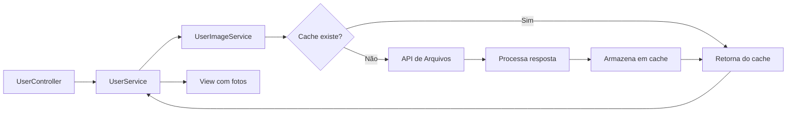

# Integração com API de Imagens de Usuários

## 📋 Visão Geral

Este módulo implementa a integração com a API de arquivos para exibir fotos de perfil dos usuários na listagem. A implementação segue princípios de **Clean Code** e **SOLID**, garantindo:

- ✅ Separação de responsabilidades
- ✅ Testabilidade
- ✅ Manutenibilidade
- ✅ Performance com cache
- ✅ Tratamento robusto de erros
- ✅ Fallback seguro quando API não responde

## 🏗️ Arquitetura

```
app/
├── Domain/
│   └── User/
│       └── Services/
│           ├── UserService.php          # Service principal de usuários
│           └── UserImageService.php     # Service dedicado para imagens (NOVO)
├── Http/
│   └── Controllers/
│       └── Usuario/
│           └── UserController.php       # Controller atualizado
resources/
└── views/
    └── usuario/
        └── index.blade.php              # View com suporte a fotos
```

## 🔧 Componentes Criados

### 1. UserImageService
**Localização:** `app/Domain/User/Services/UserImageService.php`

**Responsabilidades:**
- Buscar URLs das fotos de usuários da API
- Gerenciar cache de fotos (30 minutos)
- Extrair ID do usuário do nome do arquivo
- Invalidar cache quando necessário
- Tratamento de erros sem quebrar a aplicação

**Métodos principais:**
```php
// Buscar fotos de múltiplos usuários
getUsersPhotosUrls(?array $userIds = null): array

// Buscar foto de um usuário específico
getUserPhotoUrl(int $idUsuario): ?string

// Invalidar cache
invalidateCache(?array $userIds = null): void
```

### 2. UserService (Atualizado)
**Localização:** `app/Domain/User/Services/UserService.php`

**Mudanças:**
- Injeta `UserImageService` no construtor
- Método `getUserList()` agora carrega fotos automaticamente
- Adiciona `foto_url` e `inicial` a cada usuário
- Gera iniciais para avatar fallback

### 3. UserController (Atualizado)
**Localização:** `app/Http/Controllers/Usuario/UserController.php`

**Mudanças:**
- Injeta `UserImageService` no construtor
- Novo método `invalidarCacheFotos()` para forçar atualização

### 4. View (Atualizada)
**Localização:** `resources/views/usuario/index.blade.php`

**Melhorias:**
- Exibe foto do usuário quando disponível
- Fallback para avatar com iniciais
- Tratamento de erro de imagem (`onerror`)
- Avatar fallback oculto até ser necessário

## ⚙️ Configuração

### 1. Arquivo `.env`
Adicione a URL da API de arquivos:

```env
# Para desenvolvimento local
API_FILES_URL=http://localhost:3000

# Para produção (use IP ou subdomínio do servidor)
API_FILES_URL=https://api.gestornow.com
```

### 2. Cache
O sistema usa cache do Laravel para armazenar as URLs das fotos por **30 minutos**.

**Drivers de cache suportados:**
- File (padrão)
- Redis (recomendado para produção)
- Memcached

**Configurar cache no `.env`:**
```env
CACHE_DRIVER=redis
```

## 🔄 Fluxo de Dados



## 🎯 Como Usar

### Listar Usuários (Automático)
Ao chamar o método `index()` do `UserController`, as fotos são carregadas automaticamente:

```php
// No Controller
public function index(Request $request)
{
    $users = $this->userService->getUserList($filters, 50);
    // Cada $user agora tem $user->foto_url
    return view('usuario.index', compact('users'));
}
```

### Invalidar Cache Manualmente
Após upload/delete de foto:

```php
// Invalidar cache de usuário específico
$this->imageService->invalidateCache([151]);

// Invalidar cache de múltiplos usuários
$this->imageService->invalidateCache([151, 200, 305]);

// Invalidar todo o cache de fotos
$this->imageService->invalidateCache();
```

### Endpoint de Invalidação
```bash
POST /usuarios/invalidar-cache-fotos
Content-Type: application/json

{
  "user_ids": [151, 200]  // Opcional
}
```

## 🛡️ Tratamento de Erros

A implementação garante que **erros na API não quebram a aplicação**:

### Cenários Tratados:
1. ✅ API indisponível → retorna array vazio, exibe avatar com inicial
2. ✅ Timeout na requisição → retorna array vazio após 10 segundos
3. ✅ Resposta inválida da API → log de erro, continua funcionando
4. ✅ Imagem não carrega no browser → fallback automático para avatar
5. ✅ Cache corrompido → recria cache na próxima requisição

### Logs
Todos os erros são registrados em `storage/logs/laravel.log`:

```php
Log::error('UserImageService: Erro ao buscar fotos de usuários', [
    'erro' => $e->getMessage(),
    'trace' => $e->getTraceAsString()
]);
```

## 🎨 Frontend

### HTML Gerado
```html
<div class="avatar avatar-sm me-3">
    <!-- Com foto -->
    
    
    <!-- Sem foto (fallback) -->
    <span class="avatar-initial rounded-circle bg-label-primary">
        JS
    </span>
</div>
```

### Estilos Aplicados
- `width: 38px; height: 38px` - Tamanho fixo
- `object-fit: cover` - Manter proporção
- `border-radius: 50%` (via classe `.rounded-circle`)
- Fallback oculto por padrão, exibido apenas se imagem falhar

## 📊 Performance

### Otimizações Implementadas:
1. **Cache de 30 minutos** - Reduz chamadas à API
2. **Busca em lote** - Uma requisição para todos os usuários da página
3. **Lazy loading** - Apenas IDs da página atual são buscados
4. **Timeout de 10s** - Não trava a aplicação
5. **Compressão de imagens** - API entrega imagens otimizadas

### Métricas Esperadas:
- **Primeira carga:** ~200-500ms (com API)
- **Cargas subsequentes:** ~5-10ms (do cache)
- **Com API indisponível:** ~10s (timeout + fallback)

## 🧪 Testes

### Testar Manualmente:

```bash
# 1. Listar usuários (deve carregar fotos)
GET /usuarios

# 2. Invalidar cache
POST /usuarios/invalidar-cache-fotos

# 3. Recarregar lista (deve fazer nova requisição à API)
GET /usuarios
```

### Verificar Cache:
```bash
php artisan tinker

# Ver cache
Cache::get('user_photos_all');

# Limpar cache
Cache::forget('user_photos_all');
```

### Simular API Indisponível:
Altere temporariamente a URL no `.env`:
```env
API_FILES_URL=http://localhost:9999
```

Recarregue a página - deve exibir avatares com iniciais.

## 🔐 Segurança

### Validações Implementadas:
- ✅ URLs escapadas no Blade (`{{ }}`)
- ✅ Timeout para evitar requisições infinitas
- ✅ Validação de estrutura da resposta da API
- ✅ Tratamento de exceções em todos os níveis
- ✅ Fallback seguro quando dados ausentes

### Boas Práticas:
- Usar HTTPS em produção
- Configurar CORS na API de arquivos
- Implementar rate limiting na API
- Monitorar logs de erro

## 📝 Manutenção

### Ajustar Tempo de Cache:
Em `UserImageService.php`:
```php
private int $cacheMinutes = 60; // Alterar para 60 minutos
```

### Alterar Formato de Nome do Arquivo:
Se a API mudar o padrão de nomenclatura, ajustar em:
```php
private function extractUserIdFromFilename(string $filename): ?int
{
    // Ajustar lógica aqui
}
```

### Adicionar Novos Endpoints:
Basta adicionar métodos no `UserImageService` seguindo o mesmo padrão.

## 📚 Referências

- [Documentação da API de Arquivos](../docs/api-arquivos.md)
- [Laravel HTTP Client](https://laravel.com/docs/http-client)
- [Laravel Cache](https://laravel.com/docs/cache)
- [Clean Code Principles](https://clean-code-developer.com/)

## 🤝 Contribuindo

Ao adicionar funcionalidades relacionadas:

1. Manter separação de responsabilidades
2. Adicionar logs apropriados
3. Tratar erros sem quebrar a aplicação
4. Documentar mudanças neste README
5. Seguir padrões existentes do projeto

---

**Implementado em:** Janeiro 2025  
**Desenvolvido seguindo:** Clean Code, SOLID, DRY, KISS
